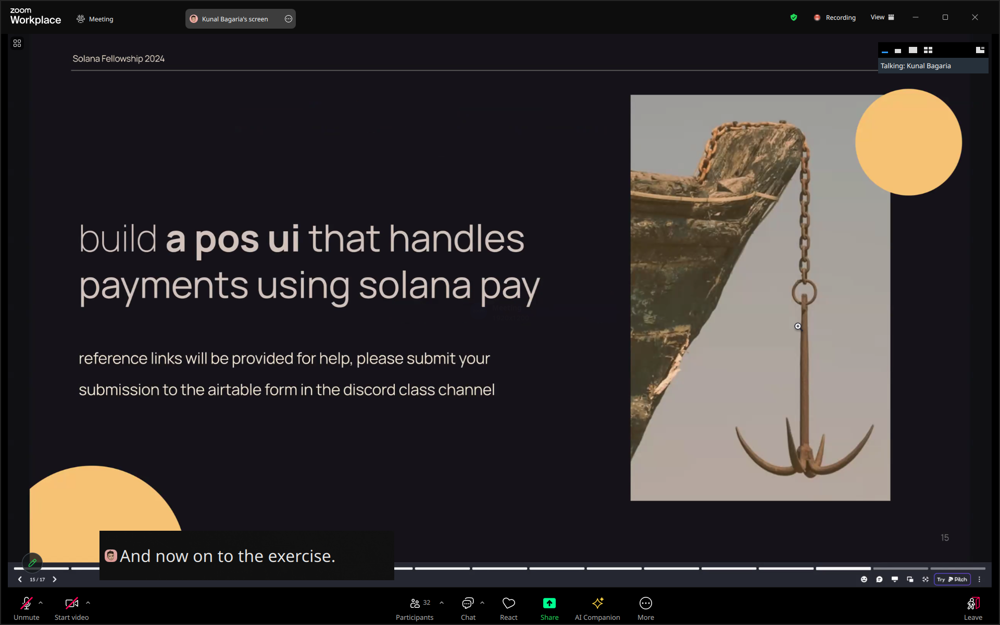
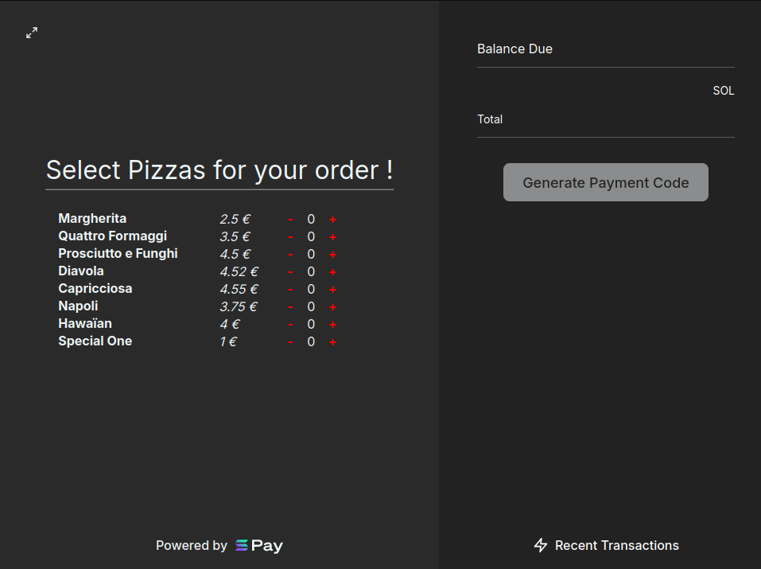
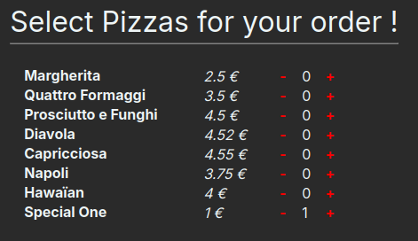
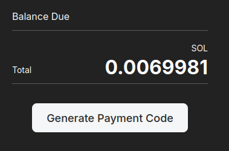
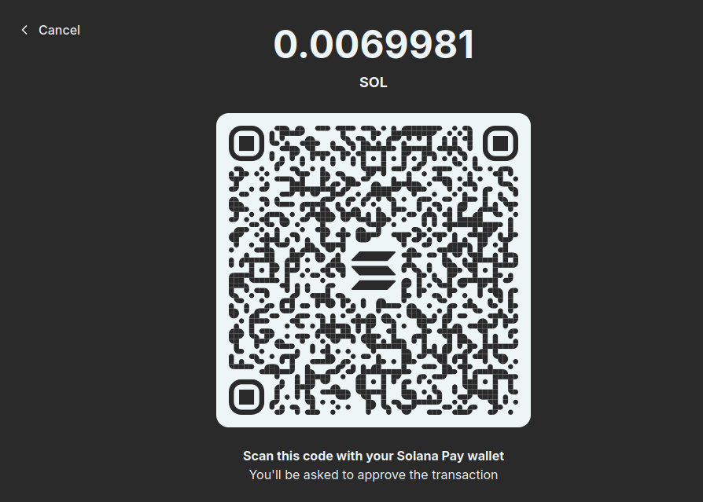
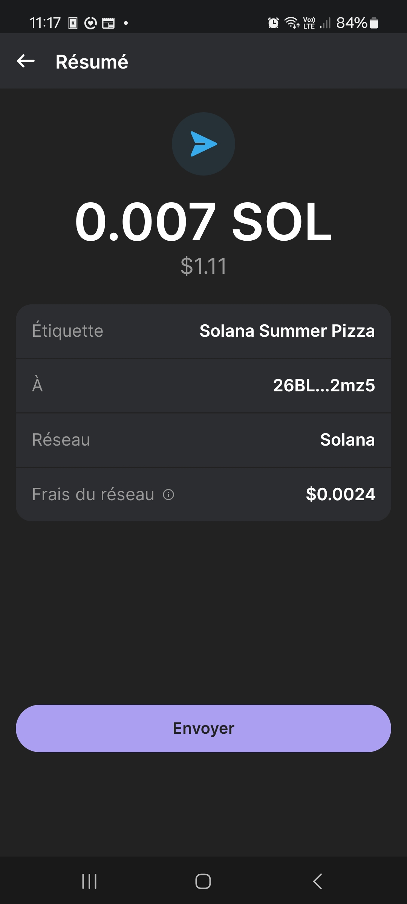
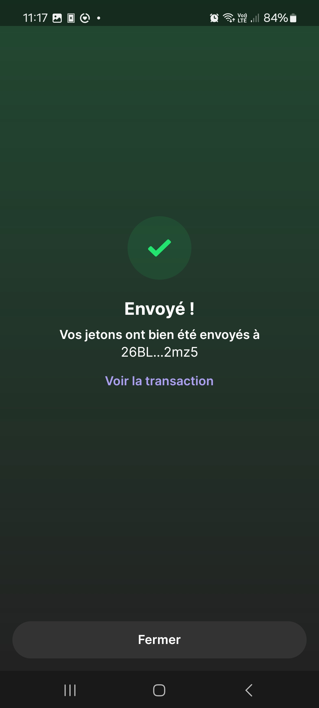
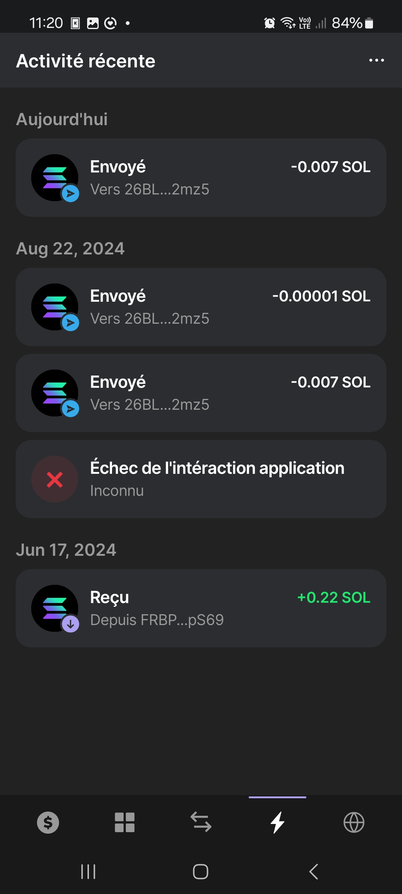
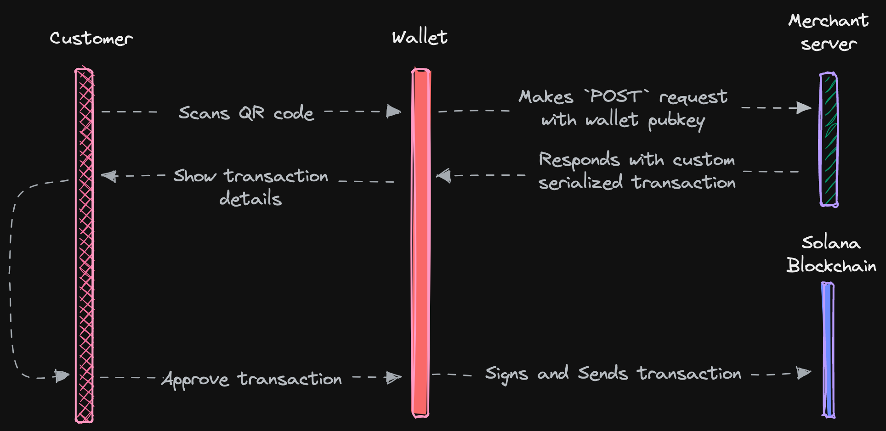

# Solana Pay Point-Of-Sale




Build a **Point-Of-Sale Web UI** for adding products and checking out with **Solana Pay**. The payment confirmation should be displayed after checkout.


> Not being a "front-end" developer, I started from a robust [existing base](https://github.com/anza-xyz/solana-pay/tree/master/examples/point-of-sale) as framework to help me, in order to minimize the NextJS development time and focus mainly on understanding **Solana Pay** itself. It will be used as a model for future developement.


--------

**TABLE OF CONTENTS**


<!-- TOC -->

- [Solana Pay Point-Of-Sale](#solana-pay-point-of-sale)
	- [Installation](#installation)
	- [Usage...](#usage)
		- [On Web UI](#on-web-ui)
		- [On Mobile phone](#on-mobile-phone)
		- [Transaction details](#transaction-details)
	- [Overview of application](#overview-of-application)
		- ["QRCode.tsx"](#qrcodetsx)
			- [Payment URL](#payment-url)
			- [QR Code generation](#qr-code-generation)
			- [Rendering the component](#rendering-the-component)
		- ["index.ts"](#indexts)
			- [Overview](#overview)
			- [GET handler](#get-handler)
			- [POST handler](#post-handler)
			- [Main handler](#main-handler)
		- ["PaymentProvider.tsx"](#paymentprovidertsx)
			- [Overview](#overview)
			- [Transaction URL Construction encodeURL](#transaction-url-construction-encodeurl)
			- [Creating and Sending the Transaction](#creating-and-sending-the-transaction)
			- [Waiting for transaction confirmation](#waiting-for-transaction-confirmation)
	- [Resources](#resources)

<!-- /TOC -->


--------


## Installation

**Clone the repo:**

```bash
git clone https://github.com/Laugharne/ssf_s6_exo.git
```

**Install dependencies:**

```bash
npm install
```

**Starting a local dev server:**

```bash
npm run dev
```

**Starting a local proxy:**

In an other terminal (_same path_) run the server who handles responses and transactions.

```bash
npm run proxy
```

**Local URL:**

[` https://localhost:3001?recipient=26BLvEsyA6n1eVDyV8U4g78V47M7v6PQ4QHmedV12mz5&label=Solana+Summer+Pizza `](https://localhost:3001?recipient=26BLvEsyA6n1eVDyV8U4g78V47M7v6PQ4QHmedV12mz5&label=Solana+Summer+Pizza)

You need a **two wallets** to use the app
1. One to interact with the app. (_You can use Phantom or any other wallet that supports Solana._)
2. And another wallet serving as the shop's cash register.

Both need to be funded with SOL, one for payments and the other to facilitate transactions.


## Usage...

The final goal of the exercise being simply to complete a transaction with Solana Pay, I didn't bother to implement a dynamic conversion from Euros to SOL or to make a payment in USDC. The conversion rate is therefore **hard-coded** into the code!

The application is utilizing the mainnet for this occasion, as **the devnet has been notably unstable in recent days!**

To use the application, please ensure you have enough SOL in your wallets.


### On Web UI



I have just selected the **"Special ONE" pizza** for the demo !



It costs only **0.0069981 SOL**



The **QR-Code** generated for ths transaction is:




### On Mobile phone

After scanning the QR-Code with the **Phantom** app of the **mobile phone**, we will see how much it will cost (_fee included_)



Confimation of the transaction



Transaction listed on the recent **activity list**...




### Transaction details


- [Solscan](https://solscan.io/tx/4ARWs3xBhpTmTS1NLKhCM4nxyYC5uq9RND6JNVAGqjAWsjpHH1hXAB9yucMEMAHYDrGGfmcrbWtM9A5XSxN6FWqq)
- [Solana Explorer](https://solana.fm/tx/4ARWs3xBhpTmTS1NLKhCM4nxyYC5uq9RND6JNVAGqjAWsjpHH1hXAB9yucMEMAHYDrGGfmcrbWtM9A5XSxN6FWqq?cluster=mainnet-alpha)


## Overview of application

Overall, the transaction process with Solana Pay involves several steps, including generating a transaction request URL, retrieving the label and icon for the transaction, creating a transfer transaction, signing the transaction with the wallet, and submitting the transaction to the Solana network.



This overview connects with the code examples provided in **several source files** and Solana Pay implementation, illustrating how each element contributes to the overall payment process.


### "QRCode.tsx"

> src/client/components/contexts/QRCode.tsx

This `QRCode` component is designed to display dynamically a **QR code** based on a **payment URL**.


**Imports needed:**

```typescript
import { createQROptions } from '@solana/pay';
import QRCodeStyling from '@solana/qr-code-styling';
```

#### Payment URL

```typescript
const { url } = usePayment();
```
This hook retrieves the necessary payment data, specifically the payment URL (`url`), which is used to generate the **QR code**.


#### QR Code generation

**QR Code options**

```typescript
const [size, setSize] = useState(() =>
    typeof window === 'undefined' ? 400 : Math.min(window.screen.availWidth - 48, 400)
);
```
The state `size` represents the size of the QR code. If the code is executed server-side (`typeof window === 'undefined'`), the default size is set to 400 pixels. Otherwise, it calculates the size based on the available screen width (`window.screen.availWidth`), minus 48 pixels, with a maximum of 400 pixels.

```typescript
const options = useMemo(() => createQROptions(url, size, 'transparent', '#2a2a2a'), [url, size]);
```
The QR code options, generated by `createQROptions()`, are recalculated only when the payment URL (`url`) or the size (`size`) changes. This optimizes performance by avoiding unnecessary recalculations.


**QR Code instance**

```typescript
const qr = useMemo(() => new QRCodeStyling(), []);
```
This library allows the creation of customized QR codes. `useMemo` ensures that the `QRCodeStyling` instance is only created once (on the first render).


#### Rendering the component

```typescript
useEffect(() => qr.update(options), [qr, options]);
```
Whenever the **QR code options** change (_due to changes in the URL or size_), the **QR code instance** is updated with the new options.

```typescript
const ref = useRef<HTMLDivElement>(null);
```
This reference is used to directly access a DOM element (`div`) where the **QR code** will be rendered.

```typescript
useEffect(() => {
    if (ref.current) {
        qr.append(ref.current);
    }
}, [ref, qr]);
```
Once the `ref` to the `div` is set (_not null_), the QR code is appended to this DOM element using the `append()` method.

```typescript
return <div ref={ref} className={css.root} />;
```
The component returns a simple `div` with a reference (`ref`) and a CSS class. This `div` is where the QR code will be rendered.


### "index.ts"

> src/server/api/index.tsx

#### Overview

This code defines an API route in a Next.js application that interacts with the Solana blockchain using Solana Pay.

The route handles both `GET` and `POST` requests for this two  functionalities:
1. Serving metadata about the payment (_like a label and icon_).
2. Creating a Solana transaction for a payment request.

This API route is designed to facilitate payments on the Solana blockchain using Solana Pay. It provides a way to fetch metadata about a payment request via a `GET` request and to create a payment transaction via a `POST` request.

#### GET handler

The `get` function handles `GET` requests and returns metadata for the payment request.

```typescript
interface GetResponse {
    label: string;
    icon : string;
}

const get: NextApiHandler<GetResponse> = async (request, response) => {
    const label = request.query.label;
    if (!label) throw new Error('missing label');
    if (typeof label !== 'string') throw new Error('invalid label');

    const icon = `https://${request.headers.host}/solana-pay-logo.svg`;

    response.status(200).send({
        label,
        icon,
    });
};
```

#### POST handler

The `post` function handles `POST` requests to create a Solana transaction.

**Input Validation**: The function validates several parameters from the query string (`recipient`, `amount`, `spl-token`, `reference`, `memo`, and `message`) and the request body (`account`).

**Transaction creation**:

- **`createTransfer`**: A transaction is created using the `createTransfer` function, which constructs a transfer operation on the Solana blockchain with the provided parameters (e.g., recipient, amount, SPL token, reference, and memo).
```typescript
let transaction = await createTransfer(connection, account, {
    recipient,
    amount,
    splToken,
    reference,
    memo,
});
```
- **Serialization**: The transaction is serialized and deserialized to ensure consistent ordering of account keys, which is important for signature verification.

```typescript
transaction = Transaction.from(
    transaction.serialize({
        verifySignatures    : false,
        requireAllSignatures: false,
    })
);
```
- **Response**: The serialized transaction is converted to a base64 string and returned to the client along with an optional message.
```typescript
const serialized = transaction.serialize({
    verifySignatures    : false,
    requireAllSignatures: false,
});
const base64 = serialized.toString('base64');

response.status(200).send({ transaction: base64, message });
```

#### Main handler

The `index` function serves as the main API handler.

```typescript
const index: NextApiHandler<GetResponse | PostResponse> = async (request, response) => {
    await cors(request, response);
    await rateLimit(request, response);

    if (request.method === 'GET') return get(request, response);
    if (request.method === 'POST') return post(request, response);

    throw new Error(`Unexpected method ${request.method}`);
};
```

- **Middleware Execution**: Runs CORS and rate-limiting middleware to ensure that the API is accessed appropriately and to prevent abuse.
- **Request Routing**: Depending on the HTTP method, it delegates the request to the appropriate handler.


### "PaymentProvider.tsx"

> src/client/components/sections/QRCode.tsx

#### Overview

- **Connection to Solana**: Interaction with the blockchain is enabled via the `connection` object.
- **Wallet Integration**: User transactions are facilitated through their connected wallet.
- **Transaction Management**: The code handles the entire lifecycle of a transaction, from creation to finalization.
- **Real-time Monitoring**: The system continuously checks for transaction confirmations and validates them to ensure the payment process is secure and accurate.


#### Transaction URL Construction (`encodeURL()`)

```typescript
const url = useMemo(() => {
    // ...
    // URL generation logic based on whether a link is provided
    // ...
}, [link, recipient, amount, splToken, reference, label, message, memo]);
```
This memoized function constructs the **payment URL**, which encodes all the necessary payment details.

**`encodeURL()`:**

Let’s delve into the `encodeURL()`. This function plays a critical role in **generating the payment URL**, which encodes all the necessary details for the transaction.

The `encodeURL()` function is part of the S**olana Pay SDK**. Its primary role is to take the payment parameters (like the recipient, amount, SPL token, etc...) and encode them into a URL format that can be shared or used to initiate a payment.

This URL can be processed by **wallets** or **payment gateways** to complete the transaction.

`encodeURL()` is used inside a `useMemo` hook to generate a **payment URL**:

The code checks if a `link` is provided:
- If `link` exist The URL is built using the provided link as a base, and additional payment parameters (like `recipient`, `amount`, etc...) are appended as query parameters.
- Else The URL is constructed from scratch using the provided payment parameters.

```typescript
const url = useMemo(() => {
    if (link) {
        const url = new URL(String(link));

        url.searchParams.append('recipient', recipient.toBase58());

        if (amount) {
            url.searchParams.append('amount', amount.toFixed(amount.decimalPlaces() ?? 0));
        }

        if (splToken) {
            url.searchParams.append('spl-token', splToken.toBase58());
        }

        if (reference) {
            url.searchParams.append('reference', reference.toBase58());
        }

        if (memo) {
            url.searchParams.append('memo', memo);
        }

        if (label) {
            url.searchParams.append('label', label);
        }

        if (message) {
            url.searchParams.append('message', message);
        }

        return encodeURL({ link: url });
    } else {
        return encodeURL({
            recipient,
            amount,
            splToken,
            reference,
            label,
            message,
            memo,
        });
    }
}, [link, recipient, amount, splToken, reference, label, message, memo]);
```

**Payment Parameters**:

- The `recipient` public key is encoded in the URL. This key specifies where the payment is sent.
- If an `amount` is specified, it is encoded in the URL, rounded to the appropriate number of decimal places.
- If the payment involves an `SPL token`, its public key is included.
- A `reference` public key that can be used to track the payment is added to the URL.
- An optional `memo` field is included, which can hold a note or other small pieces of data.
- The `label` and `message` fields can include metadata about the payment, like a label for the transaction or a message to the recipient.

**This URL can be shared or scanned**.

And a wallet can use it to automatically fill in the details for the payment.


#### Creating and Sending the Transaction

```typescript
useEffect(() => {
    if (status === PaymentStatus.Pending && connectWallet && publicKey) {
        let changed = false;

        const run = async () => {
            try {
                const request = parseURL(url);
                let transaction: Transaction;

                if ('link' in request) {
                    const { link } = request;
                    transaction = await fetchTransaction(connection, publicKey, link);
                } else {
                    const { recipient, amount, splToken, reference, memo } = request;
                    if (!amount) return;

                    transaction = await createTransfer(connection, publicKey, {
                        recipient,
                        amount,
                        splToken,
                        reference,
                        memo,
                    });
                }

                if (!changed) {
                    await sendTransaction(transaction, connection);
                }
            } catch (error) {
                console.error(error);
                timeout = setTimeout(run, 5000);
            }
        };
        let timeout = setTimeout(run, 0);

        return () => {
            changed = true;
            clearTimeout(timeout);
        };
    }
}, [status, connectWallet, publicKey, url, connection, sendTransaction]);
```
This `useEffect` handles the creation and sending of the transaction. Depending on whether a `link` is provided or not, the transaction is either fetched from a link or created with the provided details (recipient, amount, etc...).

Then the transaction is sent using the connected wallet’s `sendTransaction()` method.


#### Waiting for transaction confirmation

```typescript
useEffect(() => {
    if (status === PaymentStatus.Pending && reference && !signature) {
        const interval = setInterval(async () => {
            try {
                const foundSignature = await findReference(connection, reference);
                setSignature(foundSignature.signature);
                setStatus(PaymentStatus.Confirmed);
            } catch (error) {
                if (!(error instanceof FindReferenceError)) console.error(error);
            }
        }, 250);
        return () => clearInterval(interval);
    }
}, [status, reference, signature, connection]);
```
This effect continuously polls the blockchain to find a signature for the transaction. Once the transaction is found and confirmed, the status is updated to `Confirmed`.


**Transaction validation**

```typescript
useEffect(() => {
    if (status === PaymentStatus.Confirmed && signature && amount) {
        const run = async () => {
            try {
                await validateTransfer(connection, signature, {
                    recipient,
                    amount,
                    splToken,
                    reference,
                });
                setStatus(PaymentStatus.Valid);
            } catch (error) {
                console.warn(error);
                setTimeout(run, 250); // Retry on failure
            }
        };
        run();
    }
}, [status, signature, amount, connection, recipient, splToken, reference]);
```
Once a transaction is confirmed, this effect validates the transaction details against what was expected. If the validation is successful, the status is updated to `Valid`.

**Payment status**

See `PaymentStatus` in `src/client/hooks/usePayment.ts`

```typescript
export enum PaymentStatus {
    New       = 'New',
    Pending   = 'Pending',
    Confirmed = 'Confirmed',
    Valid     = 'Valid',
    Invalid   = 'Invalid',
    Finalized = 'Finalized',
}
```


**Confirmations**

```typescript
    useEffect(() => {
        if (!(status === PaymentStatus.Valid && signature)) return;
        let changed = false;

        const interval = setInterval(async () => {
            try {
                const response = await connection.getSignatureStatus(signature);
                const status   = response.value;
                if (!status) return;
                if (status.err) throw status.err;

                if (!changed) {
                    const confirmations = (status.confirmations || 0) as Confirmations;
                    setConfirmations(confirmations);

                    if (confirmations >= requiredConfirmations || status.confirmationStatus === 'finalized') {
                        clearInterval(interval);
                        setStatus(PaymentStatus.Finalized);
                    }
                }
            } catch (error: any) {
                console.log(error);
            }
        }, 250);

        return () => {
            changed = true;
            clearInterval(interval);
        };
    }, [status, signature, connection, requiredConfirmations]);
```

This effect monitors the transaction confirmations. It checks if the transaction has reached the required number of confirmations to be considered finalized. Once finalized, the status is updated accordingly.


## Resources

**Introduction:**
- [Solana Pay explained in 100 seconds - YouTube](https://www.youtube.com/watch?v=nV6Y8nXS5-U)
- [A decentralized, permissionless, and open-source payments protocol | Solana Pay](https://solanapay.com/fr)
- [Solana Pay | Solana](https://solana.com/developers/courses/solana-pay/solana-pay)

**Quicknode:**
- [What is Solana Pay and How to Use It](https://www.quicknode.com/guides/solana-development/solana-pay/getting-started-with-solana-pay)
- [How to Use Solana Pay with Custom Solana Programs](https://www.quicknode.com/guides/solana-development/solana-pay/beyond-pay-custom-programs)

**Anza:**
- [GitHub - anza-xyz/solana-pay: A new standard for decentralized payments.](https://github.com/anza-xyz/solana-pay)
- [solana-pay/examples/point-of-sale at master · anza-xyz/solana-pay · GitHub](https://github.com/anza-xyz/solana-pay/tree/master/examples/point-of-sale)
- [app.solanapay.com/](https://app.solanapay.com/new?recipient=GvHeR432g7MjN9uKyX3Dzg66TqwrEWgANLnnFZXMeyyj&label=Solana+Pay)
- [A simple guide on how to set up Solana Pay's POS system on Devnet - DEV Community](https://dev.to/tunkunmi/a-simple-guide-on-how-to-set-up-solana-pays-pos-system-on-devnet-1jhl)
- [Solana Storefront with Solana Pay - YouTube](https://www.youtube.com/watch?v=TBQA29217Kk)

**Python:**
- [GitHub - Solana-Workshops/storefront-solana-pay: A storefront build with Solana Pay!](https://github.com/Solana-Workshops/storefront-solana-pay)
- [Solana Workshop: SolanaPay Storefront - YouTube](https://www.youtube.com/watch?v=jG-uJqDMpCY)

**Misc:**
- [Create a transaction request | Solana Pay Docs](https://docs.solanapay.com/core/transaction-request/merchant-integration)
- [crates.io: Rust Package Registry](https://crates.io/crates/solana-pay)
- [solana_pay - Rust](https://docs.rs/solana-pay/latest/solana_pay/)
- [anchor - Integrating Solana Pay with Rust Code - Solana Stack Exchange](https://solana.stackexchange.com/questions/75/integrating-solana-pay-with-rust-code)
- [GitHub - 256hax/solana-anchor-react-minimal-example: Solana, Anchor, Metaplex, React Minimal Example. Out of the Box, easy to start!](https://github.com/256hax/solana-anchor-react-minimal-example)
- [blockchain - Make a Solana program pay for the transaction - Stack Overflow](https://stackoverflow.com/questions/72790319/make-a-solana-program-pay-for-the-transaction)
- [Solana Pay: Simplify your Transaction Requests [Solana Tutorial] - May 11th '23 - YouTube](https://www.youtube.com/watch?v=8mIBeDMgTDc)
